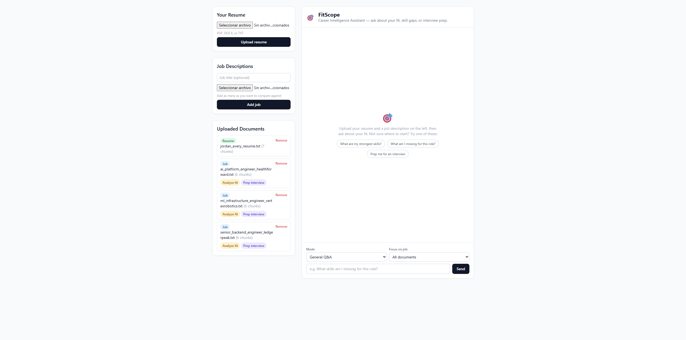
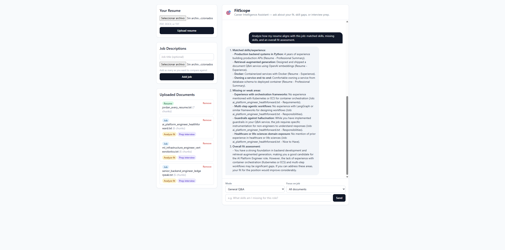
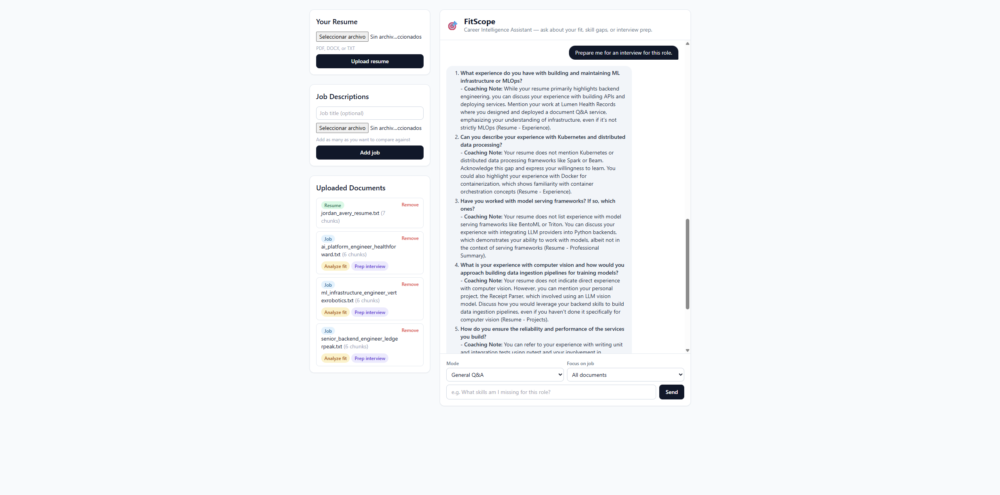

# FitScope — Career Intelligence Assistant

A RAG-based assistant that answers questions about how a resume fits one or more job descriptions:
matched skills, gaps, and interview prep. Upload a resume once, add as many job descriptions as you want
to compare against, then ask questions in plain English.

Built for the Newpage AI Forward Deployed Engineer take-home assignment (Option 4: Career Intelligence
Assistant).

## Quick setup

Requires an OpenAI API key (used for embeddings always, and for chat if `LLM_PROVIDER=openai`) and,
optionally, an Anthropic API key (chat only, if `LLM_PROVIDER=claude`).

```bash
cp .env.example .env
# edit .env and add OPENAI_API_KEY (and ANTHROPIC_API_KEY if you want Claude for chat)
```

**Docker (recommended):**

```bash
docker compose up --build
```

**Local Python:**

```bash
python -m venv .venv
source .venv/bin/activate  # .venv\Scripts\activate on Windows
pip install -r requirements.txt
uvicorn app.main:app --reload
```

Either way, open `http://localhost:8000`. Upload a resume, upload one or more job descriptions, pick a
mode (General / Skill-gap / Interview prep), and ask a question. `samples/` has a fictional resume and
three fictional job descriptions (close fit, partial fit, poor fit) if you want something to upload
immediately instead of your own documents — see `samples/README.md`.

```bash
pip install -r requirements-dev.txt
pytest                    # unit + integration tests, mocked LLM/embedder, no API key needed
ruff check app tests evals
python -m evals.run_evals # real LLM calls against samples/, costs API usage — see "Evals" below
```

## Architecture

Single FastAPI service, no separate frontend build, no external vector database:

```
Browser (HTMX + Jinja2 templates)
        |
        v
FastAPI app (app/main.py)
  ├─ api/routes/ui.py        server-rendered HTML endpoints (what the browser actually calls)
  ├─ api/routes/documents.py JSON API: upload / list / delete documents
  ├─ api/routes/chat.py      JSON API: ask a question
  |
  v
services/                    orchestration
  ├─ ingestion_service.py    parse -> normalize -> chunk
  ├─ retrieval_service.py    embed -> index / search
  └─ chat_service.py         retrieval -> prompt assembly -> LLM call
  |
  v
domain/                      framework-free core logic
  ├─ models.py                entities (Chunk, ParsedDocument, ScoredChunk, ...)
  ├─ chunking.py               section-aware chunker
  ├─ prompts.py                system prompts, guardrails, context formatting
  ├─ text_normalize.py         PDF/DOCX typographic cleanup
  └─ markdown_render.py        sanitized Markdown -> HTML for the chat UI
  |
  v
infra/                        adapters, swappable behind small interfaces
  ├─ parsers/     (pdf via pymupdf, docx, txt)
  ├─ embeddings/  (OpenAI)
  ├─ llm/         (Claude and OpenAI, chosen via LLM_PROVIDER)
  ├─ vectorstore/ (numpy-based cosine similarity store, persisted to disk)
  └─ observability/logging.py  structlog configuration
```

`documents.py`/`chat.py` (JSON) and `ui.py` (HTML fragments for HTMX) are two thin layers over the same
service layer — API consumers get raw text and can render it however they want; the browser gets
sanitized HTML fragments shaped for `hx-swap`.

## RAG / LLM approach and decisions

**Chunking.** Resumes and job descriptions are already organized into meaningful sections (Experience,
Skills, Requirements...). `domain/chunking.py` first splits on a bilingual (EN/ES) set of known section
headers, then falls back to fixed-size splitting (1000 chars, 150 overlap) only *within* a section that's
too long for one chunk. Plain fixed-size chunking was tried conceptually and rejected early: it routinely
cuts a bullet point in half or merges "Education" into "Certifications", which directly hurts precision on
questions like "what skills are listed?". Each chunk keeps its section label, which is what makes citation
possible later ("Resume - Skills").

**Embedding model: OpenAI `text-embedding-3-small`.** Used for every document regardless of which LLM
answers the chat, since it's small, cheap, good enough at this corpus size (a resume plus a handful of job
descriptions — at most a few hundred chunks), and multilingual enough that the bilingual chunker's EN/ES
header set is not the only thing making cross-language retrieval work.

**Vector store: a plain numpy array, not Chroma/Pinecone/pgvector.** `infra/vectorstore/numpy_store.py` is
an L2-normalized `(n, d)` numpy array plus a dot product for cosine similarity — brute-force, `O(n*d)`,
sub-millisecond at this scale. Chroma was tried first (see the second commit in this repo) and dropped: its
native dependencies were fragile to install cross-platform, for a benefit (an ANN index) this project's
corpus size doesn't need. Everything talks to it through a small `VectorStore` interface, so it's a
one-file swap the day the corpus stops fitting in memory or concurrent writers are needed — that's the
first thing I'd change, not a rewrite.

**LLM: Claude or OpenAI, swappable via `LLM_PROVIDER`, no code change.** Both providers implement the same
`LLMProvider.complete()` protocol and return a common `LLMResponse` (text, token counts, latency, model
name). `.env.example` defaults to `openai` so the app works out of the box with a single API key (OpenAI
is already required for embeddings); set `LLM_PROVIDER=claude` and add `ANTHROPIC_API_KEY` to switch chat
to Claude with no code touched. Temperature is fixed low (0.2, not 0.0) on both providers: this assistant
answers factual questions grounded in retrieved text, not creative writing, and low temperature measurably
reduced answer-phrasing variance during eval development (see "Evals" below) without making answers read
as repetitive the way `temperature=0` sometimes does.

**Retrieval approach: two separate searches per question, not one filtered call.** `ChatService.ask()`
always retrieves resume chunks and job-description chunks separately (resume: fixed top-10; job: top-8,
configurable via `MAX_CONTEXT_CHUNKS`) rather than a single call scoped by `doc_id`. This exists because of
a bug found while testing manually: scoping one filtered search to "Job #2" also excludes the resume
(different `doc_id`), and the model quietly filled the gap by inventing plausible-sounding resume
citations instead of refusing. There's a regression test for this
(`tests/unit/test_chat_service.py::test_ask_always_includes_resume_even_when_scoped_to_one_job`). The
resume also gets a bigger fixed budget instead of splitting top-k evenly with the job, because an even
split under-fetched the (short) resume and the model cited a section it hadn't actually retrieved. No
reranking, no hybrid BM25 + vector search — at this corpus size, dense retrieval alone is enough, and
adding a second retrieval mechanism would be complexity in search of a problem it doesn't have here yet.

**Comparing against every uploaded job at once doesn't pool them into one search, either.** The "Focus on
job" selector's "All documents" option (`doc_id=None`) used to run one top-k search across every uploaded
job's chunks pooled together — found live, with three jobs uploaded, a generic "what am I missing"
question came back grounded in only one of them, because that job's chunks happened to embed closest to
the question; the other two were silently absent from the model's context, with no signal of that beyond
reading each citation closely. `RetrievalService.search_job_descriptions` now searches each uploaded job
separately and concatenates when no single job is selected, so every uploaded job is guaranteed to
contribute chunks — the same "generous, fixed budget beats an even split" reasoning as the resume budget
above, applied to jobs now that there's more than one to lose to the same failure mode. There's a
regression test for this
(`tests/unit/test_retrieval_service.py::test_search_job_descriptions_across_all_jobs_includes_every_job`)
and an eval case exercising it against the real LLM
(`evals/cases.py::all_jobs_scope_covers_every_uploaded_job`).

**Only one active resume at a time.** Uploading a new resume replaces the previous one
(`RetrievalService.index_chunks`) rather than accumulating both. Job descriptions intentionally support
many at once (that's the product: compare one resume against several jobs), but resumes have no equivalent
`doc_id` scoping and are cited in context as a bare `"Resume"` label with no title — found live, uploading a
second resume silently blended both people's/versions' chunks into every answer with no way to tell them
apart. The UI already frames this as "Your Resume" (singular, one upload slot); the backend now enforces
what the UI already implied.

**Prompt & context management.** `domain/prompts.py` builds one shared guardrail block plus a small
per-mode addendum (General / Skill-gap / Interview-prep), rather than one prompt per intent — the three
modes are the same task ("answer from retrieved resume/job context") with a different required output
*shape*, not different safety rules. Context is formatted as labeled blocks (`[Resume - Skills]`,
`[Job: <title> - Requirements]`) so the model has a literal string to cite and the guardrails can require
it not to invent a section label that doesn't appear in that block. Chat history is not used to rewrite
the retrieval query — a known, documented limitation (a follow-up like "what about the other job?" won't
resolve correctly); solving it would mean adding a query-rewriting step, which felt like scope creep for a
resume/job-fit assistant where most real questions are self-contained.

**Guardrails.** The system prompt requires: grounding strictly in the retrieved CONTEXT block (no invented
skills, employers, dates, degrees); explicit "I don't have enough information" instead of guessing; a
citation for every specific claim, restricted to section labels literally present in context (not just
plausible-sounding ones); never repeating contact details unless the user explicitly asks; redirecting
off-topic questions back to career fit; flat Markdown lists only (nested lists rendered inconsistently
across providers). Output sanitization is a second, independent layer: `domain/markdown_render.py` renders
the model's Markdown through `bleach` with an explicit tag allowlist before it reaches the browser, because
prompt guardrails constrain what the model is *asked* to do, not what a prompt-injected job description
could try to make it *emit* (e.g. a `<script>` tag).

**Quality controls.** Unit tests assert the guardrails are actually present in the system prompt for every
mode, that citations are grounded, and the resume-inclusion regression above. The real quality signal,
though, is `evals/` — a small hands-on harness that runs real questions through the real LLM against the
sample data and checks the answers for required/forbidden content. See "Testing and evals" below.

**Observability.** Every request gets a `request_id` (bound via `structlog.contextvars`, returned as an
`X-Request-ID` header) and one `request_completed` log line with method, path, status, and duration.
Document upload/delete and chat calls emit their own structured events (`document_uploaded`,
`chat_completed`, ...) with token counts and latency — enough to answer "how much did this cost" and "was
this slow" from logs alone. The chat event deliberately logs `question_length`, not the question text
itself: resumes and job questions can carry personal data, and logs shouldn't be a side channel that
undoes the guardrail against leaking contact details.

## Testing and evals

Two different kinds of correctness check, kept deliberately separate:

- **`tests/`** — 56 pytest tests (unit + integration), all against fake embedder/LLM doubles. No API key
  needed, runs in under 2 seconds, runs in CI on every push. These check *code* correctness: does chunking
  split where it should, does the vector store filter correctly, does the API return the right status
  codes, does `ChatService` assemble the right prompt. `test_ask_always_includes_resume_even_when_scoped_to_one_job`
  is a regression test for the real retrieval bug described above.
- **`evals/`** — a hands-on harness (`python -m evals.run_evals`) that ingests the fictional resume and
  three fictional job descriptions from `samples/` and asks 8 real questions through the real embedding
  and LLM providers, then checks each answer for required/forbidden content (`evals/cases.py`). This
  checks *answer quality*: does retrieval surface the right facts, does skill-gap mode name the actual
  gaps, does the assistant stay honest about a genuinely poor fit instead of defaulting to positive spin,
  does the PII guardrail hold when a question doesn't ask for contact details. It costs real API calls, so
  it's not part of CI — run it manually after touching chunking, retrieval, or prompts.

  Building this harness surfaced two real lessons worth keeping, both now reflected in `evals/cases.py`:
  substring checks on natural-language negation are fragile (an early case banned the phrase "strong fit"
  and failed on the *correct* answer, "...making you not a strong fit overall", because that string
  contains "strong fit"); and a temperature > 0 model will legitimately alternate between equivalent
  phrasings ("RAG" vs. "retrieval-augmented generation", "Kafka" vs. "message broker") across runs, so
  `must_include` supports tuples of interchangeable phrasings rather than a single literal string. A more
  robust version of this harness would replace some of these literal checks with an LLM-as-judge grading
  the answer against a rubric instead of grep-style matching — the honest limitation of what's here now is
  that it checks specific facts I hand-picked, not general answer quality.

## Engineering standards followed (and skipped)

Followed: layered architecture with the domain layer free of framework imports (testable without FastAPI
or an LLM client); Pydantic-validated config from a single `Settings` object (12-factor config, no scattered
`os.getenv`); dependency injection via FastAPI `Depends` so tests override the embedder/LLM/vector store
with fakes instead of hitting real APIs; structured logging; a linter (`ruff`) and CI (GitHub Actions)
running lint + tests on every push; small, single-purpose commits.

Skipped, deliberately, given the scope of a take-home: no authentication — anyone who can reach the
service can upload, read, or delete any document; no per-user or per-session isolation — the vector store
is one global store shared by everyone using the instance, which is fine for a single local demo and wrong
for anything with more than one concurrent user; no rate limiting; strict TDD (tests were written alongside
functionality, not systematically before it, except where noted above); no query rewriting for
conversational follow-ups. These are called out explicitly rather than hidden — see "Productionizing" for
what closes each gap.

## AI-assisted development approach

Built with Claude Code as the primary driver, in a fairly tight loop: describe the piece to build (a
service, a route, a test), review the diff, run the tests, and only move forward once both the tests and
a manual read of the code made sense to me. A few concrete do's and don'ts that came out of it:

- **Do** ask for the *reason* behind a choice, not just the code, and keep that reason in a comment or
  docstring next to the decision (most of the "why" comments in this codebase — the Chroma-to-numpy
  swap, the resume-exclusion bug, the pymupdf-vs-pypdf choice — exist because I asked "why this and not X"
  during the session and kept the answer instead of throwing it away).
- **Do** let it write the first draft of a test for a bug it just introduced or that I just found live —
  that's how `test_ask_always_includes_resume_even_when_scoped_to_one_job` exists as a permanent regression
  test instead of a one-off manual check.
- **Don't** accept a generated abstraction (a factory, an extra interface, a config flag) without asking
  whether the concrete alternative would really be worse right now — the "single prompt with a per-mode
  addendum instead of one prompt per intent" decision in `domain/prompts.py` is a case where I pushed back
  on the more "flexible" version.
- **Don't** trust a claim about behavior (does this actually fix the bug, does retrieval actually improve)
  without running it — several of the "why" comments in this repo exist specifically because something
  that looked correct on paper (an even top-k split between resume and job chunks) failed when actually
  exercised against real documents.
- Repeatability/maintainability came mostly from keeping the unit of work small (one service, one route,
  one test file at a time) and always ending a session with the test suite green, rather than from any
  tool-specific setting.

## Productionizing this

What's here now is a single container with local disk persistence — fine for a demo, not for production
multi-tenant traffic. To get there on a hyperscaler (this list assumes AWS, the same shapes exist on
GCP/Azure/Cloudflare):

- **Compute**: push the existing Docker image to ECR, run it on ECS Fargate (or Cloud Run) behind an ALB;
  no code change needed, the app is already a stateless container reading config from the environment.
- **Vector store**: swap `NumpyVectorStore` for `pgvector` on RDS or a managed vector DB (Pinecone,
  Weaviate) behind the existing `VectorStore` interface — required as soon as there's more than one
  instance, since the numpy store's on-disk state doesn't survive horizontal scaling or restarts cleanly.
- **Multi-tenancy**: add an auth layer (Cognito, Auth0, or an API key per client) and scope every document
  and every vector-store query by tenant/user ID — right now all uploaded documents live in one shared
  store, which is the single biggest gap between this and a real multi-user product.
- **Secrets**: move `OPENAI_API_KEY`/`ANTHROPIC_API_KEY` out of `.env` and into AWS Secrets Manager or SSM
  Parameter Store, injected at container start.
- **Observability**: ship the existing structlog JSON stdout straight into CloudWatch Logs (or any log
  backend that reads container stdout); add OpenTelemetry tracing and X-Ray for cross-service traces once
  this stops being the only service; the token/latency numbers already logged per request are the seed of
  a cost dashboard.
- **Reliability & cost controls**: rate limiting and per-tenant quotas at the API gateway; autoscaling
  policy on the ECS service; response caching for repeated questions; a cheaper embedding/chat model tier
  for low-stakes queries.
- **CI/CD**: extend the existing GitHub Actions workflow (`.github/workflows/ci.yml`, currently lint +
  test) to build and push the image and deploy on merge to main.

## What I'd do differently with more time

- Replace some of the eval harness's literal substring checks with an LLM-as-judge rubric grader — the
  current harness is honest about checking specific hand-picked facts rather than general answer quality.
- Add query rewriting so a follow-up question ("what about the other one?") resolves against the right
  document without the user re-stating it.
- Add per-session/per-tenant isolation for uploaded documents instead of one shared global store — the
  most important change before this could have more than one concurrent user.
- Add hybrid retrieval (BM25 + dense) once there's a real corpus large and varied enough for it to matter;
  right now it would be complexity without a measurable benefit.
- Stream chat responses token-by-token instead of waiting for the full completion — the UI already shows a
  typing indicator, so streaming would be a real, visible improvement to perceived latency.
- Add basic rate limiting and simple auth, even just an API key, before this touches any traffic that
  isn't a single trusted user's own documents.

## Known limitations

- No authentication or per-user isolation: everyone hitting one instance shares one document store.
- No conversational query rewriting: follow-up questions that rely on prior turns for context can retrieve
  the wrong chunks.
- Retrieval is dense-only, brute-force cosine similarity; fine at hundreds of chunks, not designed for a
  corpus of thousands of documents.
- No file size limit is enforced on uploads.
- PII handling is guardrail-level (the prompt tells the model not to repeat contact details unprompted),
  not a hard redaction step before the resume text ever reaches the LLM provider.

## Screenshots

**Empty state**, with the sample resume and all three sample jobs from `samples/` uploaded:



**Skill-gap analysis** (the "Analyze fit" quick action on a job card, scoped to that one job): matched
skills, missing skills, and an overall fit assessment, each claim cited back to a resume or job section:



**Interview prep** (the "Prep interview" quick action): structured questions with coaching notes grounded
in the candidate's actual resume, including honestly flagging what the resume doesn't cover instead of
inventing an answer:


